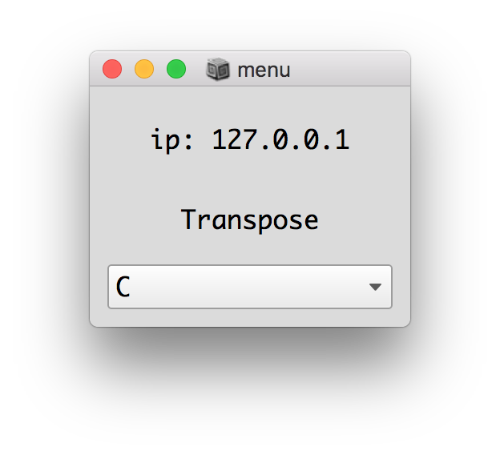
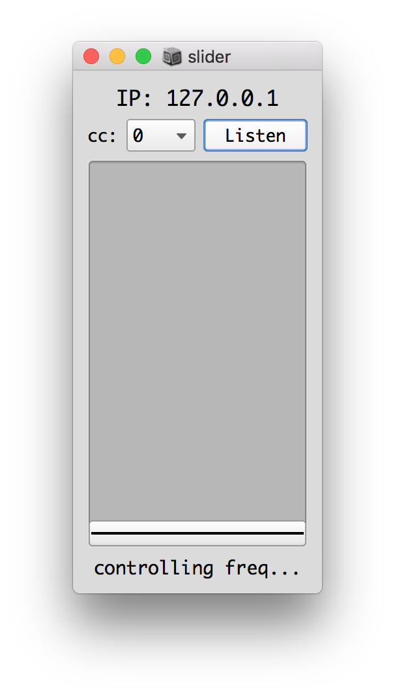
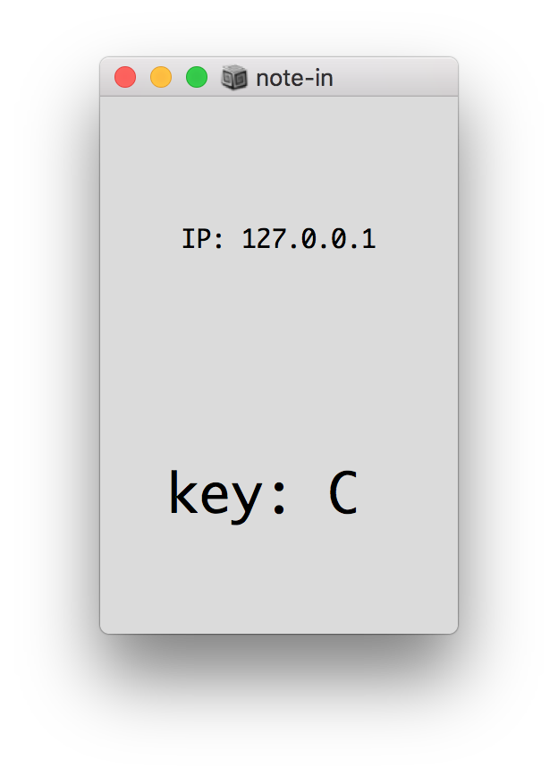

# Play it yourself for live electronics

Included in this repo are all the files necessary for the ensemble performing the piece "Play it yourself for live electronics". 

The score is included in the file [form.pdf](form.pdf), and all the SuperCollider patches are included in the folder [sc/](sc/). 

## Requirements

- Laptop running [SuperCollider](https://supercollider.github.io/download)

## Patches

### [sc/menu.scd](sc/menu.scd)

With this patch the user changes a selected parameter via a drop-down menu. The available params are: 

#### onOff

The user turn the piano on or off.

#### suspedal

The user turns on or off the sustain pedal.

#### chord

The user changes wether or not a chord can be played.

#### Transpose

The user changes the root note.

#### Scale

The user changes the modality: major, minor or hamronic minor.

### [sc/slider.scd](sc/slider.scd)

With this patch the user changes a selected parameter via a slider, which has the possibility of being connected to a midi-enabled hardware controller. The available params are:

#### freq

The user changes the "base frequency".

#### time

The user changes the overall tempo.

#### freqRange

The user changes the range of notes that can be played.

#### timeChance

The user changes the probability of 16th notes instead of 8th notes.

#### legato

The user changes the legato parameter.

#### velCenter

The user changes the overall velocity.

#### reverb

The user changes the amount of reverb.

### [sc/note-in.scd](sc/note-in.scd)

In this patch the user can control the 'tranpose' parameter via midi NoteOn messages.

